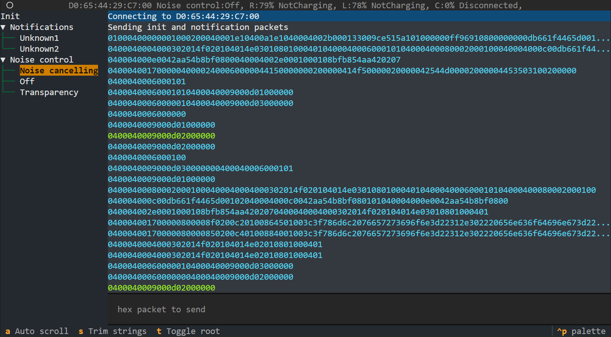

# MagicPodsCore
A console application for controlling AirPods and a description of the AAP protocol (Apple Audio Protocol).



> If you are using MagicPodsDecky, please use the Decky branch for backward compatibility. The backend will be rewritten in Python in the master branch.

## 💾 Installation

Install the required packages:

```
pip3 install asyncio textual
```

Clone the repository:

```
git clone https://github.com/steam3d/MagicPodsCore.git
```

Go to the repository directory:

```
cd MagicPodsCore
```

Run `main.py` and pass your AirPods' MAC address as an argument:

```
python3 main.py AA:BB:CC:DD:00:00
```

## 🚀 Getting Started

Connect your AirPods and run the Python script (see the installation section). The console application will connect to the headphones, and you're ready to go.

Interface is divided into the following parts:

### Header

The header contains information about the connected device:

- MAC address
- Noise control mode
- Battery level

### Packets Tree

Use the `Tab` key to select the packets tree. Select the necessary packet with the arrow keys and press `Enter` to send it to the AirPods.

### Logger Panel

Use the `Tab` key to select the logger panel. Use the arrow keys to move between log messages.

### Input

Use the `Tab` key to select the input field. Write the hex packet and press `Enter` to send it to the AirPods.

## ⚙️ Compatibility

Linux only.

### Supported Models
- AirPods 1
- AirPods 2
- AirPods 3
- AirPods 4 ANC
- AirPods Pro
- AirPods Pro 2
- AirPods Max
- AirPods Max 2024
- Beats Headphones

### Supported Features
- Noise Control
  - Noise Cancelling
  - Transparency
  - Off
- Accurate Battery Status

## 💖 Community

Join the [MagicPods Discord](https://discord.com/invite/UyY4PY768V) server
